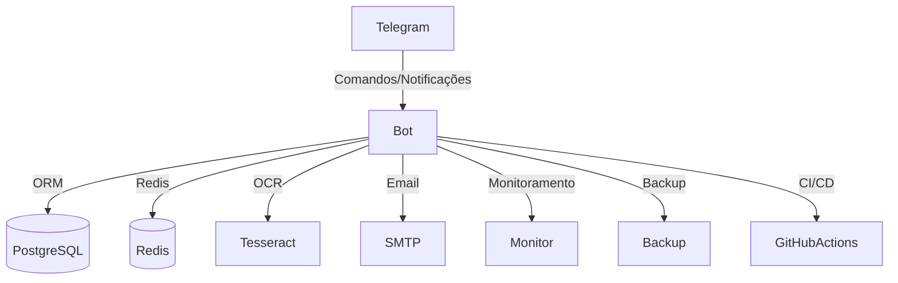

# Documentação Técnica - Julliuz Bot

## Arquitetura Geral

- **Bot:** Núcleo de comandos, handlers e lógica de negócio.
- **DB:** Banco de dados relacional (PostgreSQL) com SQLAlchemy.
- **Redis:** Cache e rate limiting.
- **OCR:** Processamento de comprovantes.
- **Email:** Notificações e alertas.
- **Monitoramento/Backup:** Scripts automáticos.
- **CI/CD:** Pipeline automatizado.

## Principais Endpoints (se expor API)

- `POST /api/transaction` - Adiciona transação
- `GET /api/report` - Relatório financeiro
- `POST /api/receipt` - Processa comprovante
- `GET /api/alerts` - Lista alertas

> **Obs:** Se não houver API exposta, o bot é o principal ponto de entrada.

## Exemplos de Uso Avançado

- **Adicionar transação:**
  `/add expense 100 food Almoço no shopping`
- **Adicionar meta:**
  `/goals add Viagem 5000 120 1000`
- **Remover conta fixa:**
  Clique no botão "Remover" ao lado da conta na listagem.
- **Receber alerta:**
  Configure um alerta e gaste acima do limite para receber notificação push.

## Auditoria
- Todas as ações críticas são registradas na tabela `audit_logs`.

## Segurança
- Validação de entradas, rate limiting, logs e monitoramento automático.

---

Para dúvidas ou sugestões, consulte o README ou abra uma issue. 